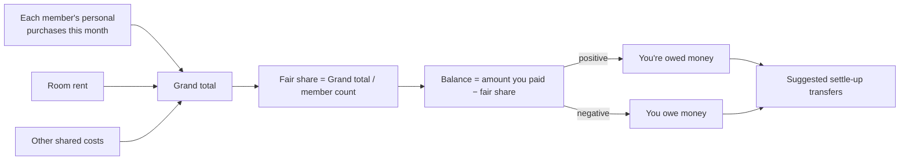
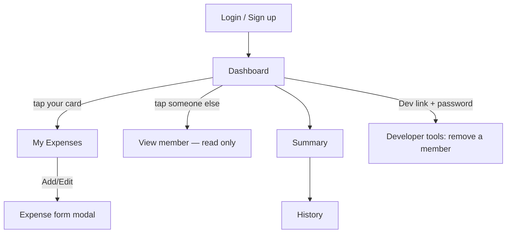

# SixSplit — Room Expense Tracker

A mobile-first prototype for splitting shared room expenses among roommates. Built as a single self-contained HTML file (`SixSplit.dc.html`) — open it directly in any browser, no build step, no install.

> **Status: interactive prototype.** Login and data are stored in the browser (`localStorage`) — there is no shared backend yet, so each person's phone has its own local copy. See "Making it real" below for the path to a shared, always-synced version.

## What it does

- **Login / signup** — each roommate creates their own username + password (no fixed headcount; anyone can join, and new roommates can sign up any time).
- **Dashboard** — every member's spend for the current month at a glance, plus your fair share and balance.
- **My Expenses** — add / edit / delete your own purchases (item, price, date). You can only edit your own entries.
- **View others (read-only)** — tap any roommate to see their expenses; you cannot edit or delete anything of theirs.
- **Summary** — personal expenses + room rent/other shared costs (editable by admins only), grand total, equal 6-way... (N-way) split, and suggested settle-up transfers ("X pays Y ₹amount").
- **History** — past months' full summaries stay browsable after the month closes.
- **Auto month rollover** — on the 1st of each month the current month closes, archives, and My Expenses starts fresh. A rolling 6-month history is kept; older months are pruned automatically.
- **Developer tools** — a password-gated panel (not available to regular members or room admins) for removing a roommate who has moved out.

## How the money math works

## Screens

## Roles

- **Member** — add/edit/delete only their own expenses; can view everyone else read-only.
- **Admin** (currently Manohar and Bhanu) — everything a member can do, plus editing the shared Room Rent / Other Expenses figures each month.
- **Developer** — a separate, hardcoded password (`sixsplit-dev`, change it before real use) gates removing a roommate's account entirely. Not tied to any member login.

## Files

- `SixSplit.dc.html` — the entire app (markup + logic in one file).
- `android-frame.jsx` — device bezel used only for the in-browser preview; not needed for a real mobile build.

## Making it real (next steps for a developer)

This prototype defines the UI, flows, and business logic precisely — it's meant to be a clear spec, not the final production app. To make it a real always-in-sync app for 6+ people:

1. **Auth**: replace the local username/password check with a real auth provider (Firebase Auth, Supabase Auth, or similar — most have a free tier).
2. **Database**: replace `localStorage` reads/writes with calls to a shared cloud database (Firestore, Supabase Postgres, etc.) so every member's phone reads/writes the same data.
3. **Hosting**: deploy the page (Firebase Hosting, Vercel, Netlify — all free for small apps) so it has a real URL every roommate can open.
4. Keep the month-rollover and settle-up logic — it's plain JavaScript and ports over as-is.

## Local preview

Just open `SixSplit.dc.html` in a browser. No server or build step required.
